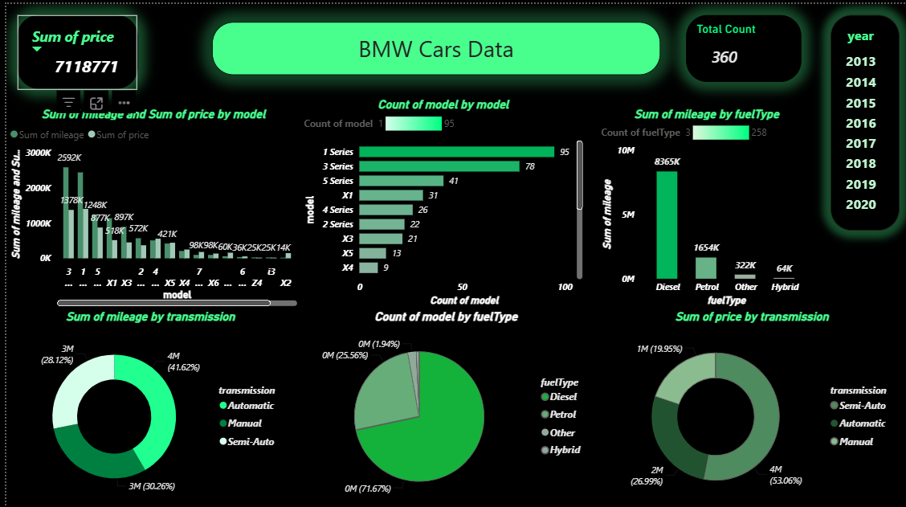

# BMW Cars Data Analysis Project

## Project Overview

This project demonstrates an end-to-end Data Analytics workflow using Excel, SQL, and Power BI.

The goal of this project was to analyze BMW vehicle data, transform raw data into meaningful insights, and build an interactive dashboard to support data-driven decision-making.

---

## Tools & Technologies Used

- Microsoft Excel (Data Cleaning & Preparation)
- SQL (Data Exploration & Analysis)
- Power BI (Dashboard Development)
- DAX (Measures & Calculations)

---

## Project Workflow

### 1. Data Cleaning (Excel)

- Cleaned and prepared the dataset for analysis
- Removed duplicate records
- Handled missing and inconsistent values
- Standardized data formats

### 2. Data Analysis (SQL)

- Explored vehicle data using SQL queries
- Analyzed trends across fuel types, models, and transmission types
- Generated insights for dashboard creation

### 3. Dashboard Development (Power BI)

- Created KPI Cards
- Designed interactive visualizations
- Added filters and slicers for better user experience
- Built a business-focused dashboard for data exploration

---

## Dashboard Features

- Total Vehicle Count
- Total Vehicle Value Analysis
- Mileage Analysis
- Fuel Type Distribution
- Transmission Type Analysis
- Model-wise Vehicle Distribution
- Interactive Year Filter

---

## Key Insights

- Diesel vehicles contribute the highest share of total mileage.
- BMW 1 Series and BMW 3 Series are among the most common vehicle models.
- Automatic transmission vehicles contribute the highest vehicle value.
- The dashboard enables quick identification of trends and patterns within the dataset.

---

## Dashboard Preview

---

## Skills Demonstrated

- Data Cleaning
- Data Analysis
- SQL Querying
- Data Visualization
- Dashboard Design
- Business Intelligence
- Power BI
- DAX
- Analytical Thinking

---

## Project Outcome

This project helped strengthen my skills in data preparation, exploratory data analysis, dashboard development, and transforming business data into actionable insights using modern analytics tools.

---

## Author

**Your Name**

Aspiring Data Analyst | SQL | Excel | Power BI | Data Visualization
